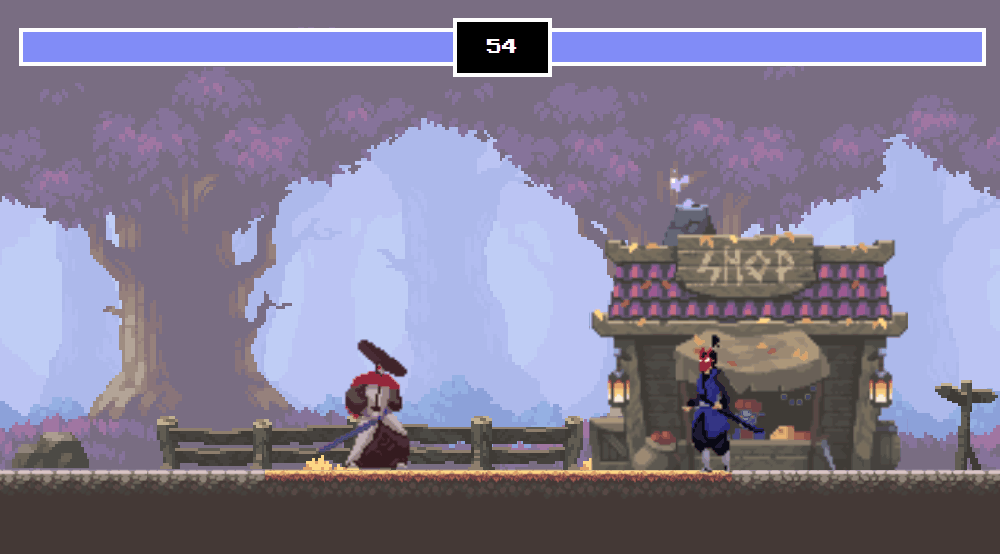

# 2d-fight-game-JS
2D fight game with JavaScript, HTML, Canvas

## URL
https://bugpigg-2d-fight-game.netlify.app/

## Overview

## Steps
### Basic Fighting Game Mechanics
1. Project Setup
    - [x] html, js 파일 생성
    - [x] html canvas API 초기 설정
2. Create Player and Enemy
    - [x] Sprite 클래스 생성
    - [x] Player, Enmey 인스턴스 생성
    - [x] 각 Sprite 인스턴스의 초기 위치 설정 로직 추가
3. Move Characters with Event Listeners
    - [x] Player, Enemy의 이동 키 매핑
    - [x] 정교한 이동을 위한 리팩토링
4. Attacks
    - [x] Player, Enemy의 attackBox 구현
    - [x] Player, Enemy의 공격 방향 설정
5. Health Bar Interface
    - [x] HTML 이용하여 Health Bar 구현
6. Game Timers and Game Over
    - [x] Game Timer 기능 구현
    - [x] Game Over 기능 구현

### Sprites and Animation
1. Background Sprite
    - 배경은 game asset 사이트 참조  
        https://itch.io/
    - [x] 클래스, 유틸 자바 스크립트 분리
    - [x] 배경 이미지 적용
2. Shop Sprite with Animation
    - [x] 배경에 Shop Sprite 추가
    - [x] 애니메이션 효과적용을 위한 코드 추가
3. Player Sprite
    - [x] Idle, Run, Jump, Attakc에 대한 Player image 적용
4. Enemy Sprite
    - [x] Idle, Run, Jump, Attakc에 대한 Enemy image 적용
5. React to Sprite Attacks
    - [x] Attack Box를 통한 공격 유무 판별 적용
6. Receive Animations
    - [x] 각 Player가 공격 받을시의 애니메이션 추가
7. Death Animations
    - [x] 각 Player 사망시 애니메이션 추가
8. Interface Design and Animation
    - [x] 체력바 디자인 수정
    - [x] 타이머 디자인 수정
    - [x] gsap cdn을 활용한 체력바 애니메이션 수정

## Wording
- `Sprite`
  - 2D 게임 내에서 움직이는 개체를 일컫는 말
  - 출처  
    https://namu.wiki/w/%EC%8A%A4%ED%94%84%EB%9D%BC%EC%9D%B4%ED%8A%B8(%EC%BB%B4%ED%93%A8%ED%84%B0%20%EA%B7%B8%EB%9E%98%ED%94%BD)

## Reference
- `Chris Courses's` JavaScript Fighting Game Tutorial with HTML Canvas  
    https://www.youtube.com/watch?v=vyqbNFMDRGQ&list=LL&index=8&t=974s
- Game Assets
  - Oak Woods Assets: https://brullov.itch.io/oak-woods
  - Fighter Asset #1: https://luizmelo.itch.io/martial-hero
  - Fighter Asset #2: https://luizmelo.itch.io/martial-hero-2